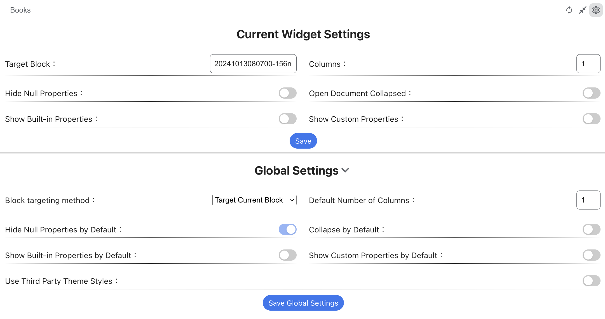

# Database Block Widget for SiYuan

[中文版](./README_zh_CN.md)
[Changelog](./CHANGELOG.md)

## Overview

This widget allows to show the database attributes of a table entry anywhere in SiYuan. It currently does not support **modifying** the attribute values. If you need that, I recommend using the [Database Properties Panel Plugin](https://github.com/Macavity/siyuan-database-properties-panel).

When multiple databases exist in a block, the last viewed database is displayed by default each time the document is opened. Otherwise, the first one is displayed, if there is no database the settings page is displayed.

### Recent Changes

- [1.0.3](https://github.com/Macavity/siyuan-database-properties-panel/releases/tag/v1.0.3) - Fix saving settings issue

### Settings

The widget allows local settings which can be configured separately for each widget. You can also set global settings that will be used when creating new instances of the widget.

#### Setting Options

* Target block
  * Creating a widget defaults to reading the document block ID where the current widget is located.
* Number of columns
  * Reads the default number of columns in the global configuration when creating a widget.
* Filter null values
  * Hide attributes if their value is null.
* Auto-collapse:
  * Used to see if the widget is automatically collapsed when the document is opened.

## Data Security Statement

Out of absolute importance to data security, this plugin hereby declares that all APIs used by the plugin, and the code is completely open source (uncompiled and not confused), everyone is welcome to report security issues

This plugin depends on the following APIs:

- `/api/av/getAttributeViewKeys`: This parameter is used to obtain existing attributes through the new attribute-view

## Widget permissions

About data: The modification of your data by this plug-in is limited to the specified modification of the properties of the specified block according to the user's instructions under the user's operation, and will not modify anything else
About UI: The user interface changes are limited to adding a properties panel under the document title, and have no effect on the rest of the section
About networking: This plug-in is completely local and does not include any extranet communication

## Support & Feedback

Please use Github issues to submit bugs or request features.

# ❤ Acknowledgements
- (Misuzu2027/sywidget-block-database-view)[https://github.com/Misuzu2027/sywidget-block-database-view/]: For the general inspiration and lots of good implementation ideas.
- (Zuoqiu-Yingyi/widget-query)[https://github.com/Zuoqiu-Yingyi/widget-query]: Learning how to set default width and height for widgets.
- (OpaqueGlass/progressBarT-sywidget)[https://github.com/OpaqueGlass/progressBarT-sywidget]: Learning how widgets save and load configurations.