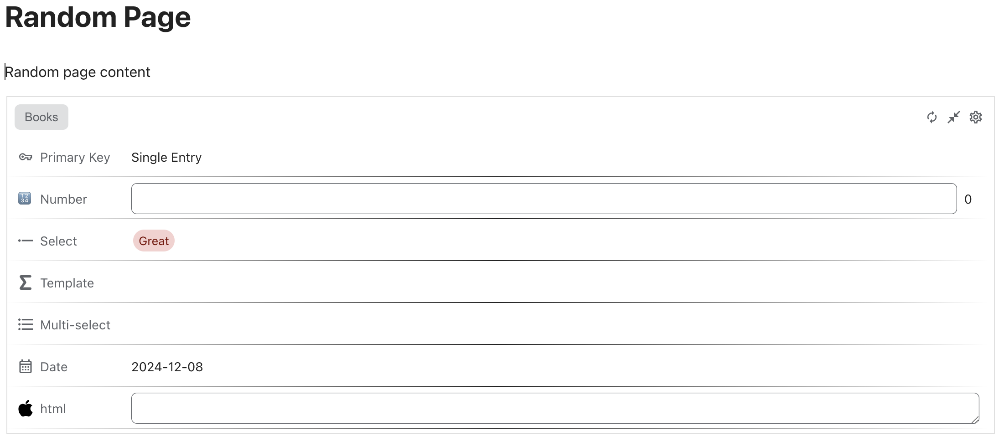
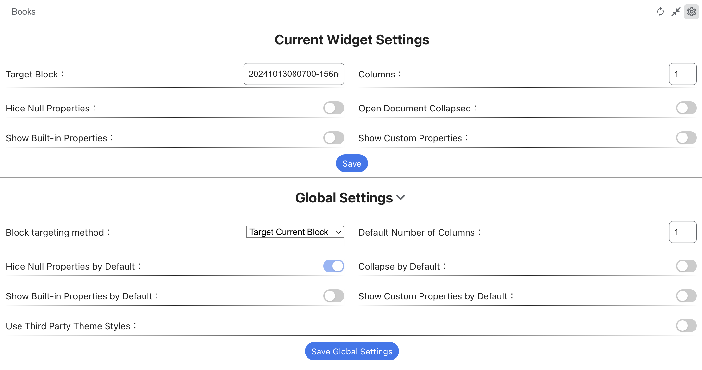

# Database Block Widget for SiYuan

[English Readme](./README.md)
[Changelog](./CHANGELOG.md)

## 概述

此 widget 只显示块的数据库属性，不支持修改属性值（暂不支持）。

当一个区块中存在多个数据库时，每次打开文档时默认显示最后查看的数据库。否则，显示第一个数据库；如果没有数据库，则显示设置页面。

### 设置

Widget 允许进行本地设置，可为每个 Widget 分别配置。您还可以设置全局设置，这些设置将在创建 widget 的新实例时使用。

#### 设置选项

* 目标块
    * 创建部件时默认读取当前部件所在的文档块 ID。
* 列数
    * 创建 widget 时，读取全局配置中的默认列数。
* 过滤空值
    * 如果属性值为空，则将其隐藏。
* 自动折叠
    * 用于查看在打开文档时 widget 是否会自动折叠。

### 数据安全声明

出于对数据安全的绝对重视，本插件特此声明，插件使用的所有 API 和代码均完全开源（未编译且不会混淆），欢迎大家报告安全问题

本插件依赖于以下 API：
- `/api/av/getAttributeViewKeys`： 该参数用于通过新的属性视图获取现有属性

## 插件权限

关于数据： 本插件对您的数据的修改仅限于在用户操作下根据用户指令对指定块的属性进行指定修改，而不会修改其他任何内容
关于用户界面： 用户界面的修改仅限于在文档标题下添加属性面板，对其他部分没有影响。
关于联网： 该插件完全本地化，不包括任何外部网络通信

# ❤ 鸣谢
- (Misuzu2027/sywidget-block-database-view)[https://github.com/Misuzu2027/sywidget-block-database-view/]: 为您提供总体灵感和很多好的实现想法。
- (Zuoqiu-Yingyi/widget-query)[https://github.com/Zuoqiu-Yingyi/widget-query]: 学习如何为 widget 设置默认宽度和高度。
- (OpaqueGlass/progressBarT-sywidget)[https://github.com/OpaqueGlass/progressBarT-sywidget]: 学习部件如何保存和加载配置。

## 支持与反馈

请使用 Github issues 提交错误或功能请求。
